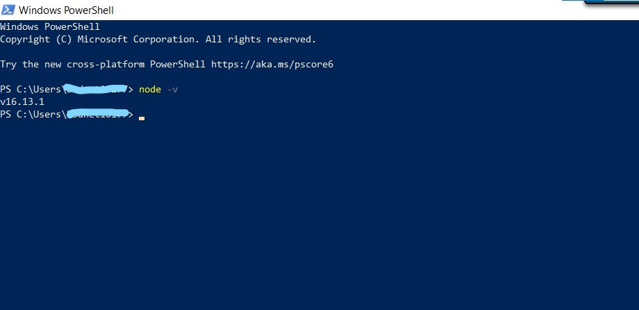
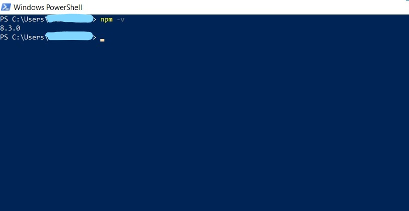
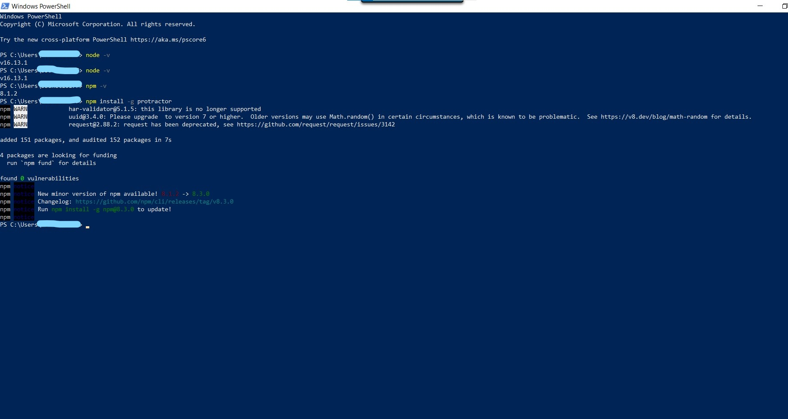
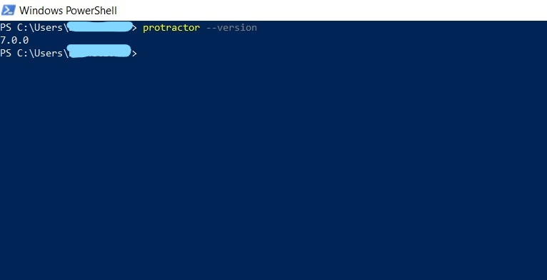

# Protractor

Protractor based test automation framework for BBD internal use.

- [Protractor](#protractor)
  - [Installation Tools and Softwares](#installation-tools-and-softwares)
  - [Running Test](#running-test)
  - [Documentation](#documentation)

## Installation Tools and Softwares
 * Download Node.js just clicking by link 
  
     [Click here to download Node.js](https://nodejs.org/en/download/)
     
 * After download Node.js set enviromental variable in System variable
 
    ``NODE_HOME "home directory of node.js"``
    
    ``path set "home directory of node.js"``
  
  * To check whethere node.js is install in your pc or not open command prompt and hit command
  
    ```
    node -v
    ```
    
    
    
   
  * To install Protractor need to check npm is installed in your PC or not to, to check open command promt and hit command
  
    ```
    npm -v
    ```
    
    
    
    
  * If npm is not present in system just update system variable path 

    ``path set C:\Program Files\nodejs\node_modules\npm\bin`` and again hit command 
    ```
    npm -v
    ```
    
  * To install protractor follow 

    [Click here to install protractor](http://www.protractortest.org/#/)
    
  * Hit the following command to install protractor in system

    ```
    npm install -g protractor
    ```
    
     
     
    
  * To check protractor installed in system or not hit command

    ```
    protractor --version
    ```
    
     
    
  * Tool for creating framework you need download VS code editor 
  * To download VS code 

    [Click here to Download VS Code](https://code.visualstudio.com/download)
    
## Running Test
  * To run tests, run the following command in Command prompt or Power Shell
  
  ```
  protractor protractor JSFiles/conf.js
  ```
  

## Documentation

  * [Protractor](http://www.protractortest.org/#/)

  * [Protractor-BDD](https://www.protractortest.org/#/frameworks)

  * [Protractor-BDD-Reports](https://www.npmjs.com/package/protractor-simple-cucumber-html-reporter-plugin)
    
    
